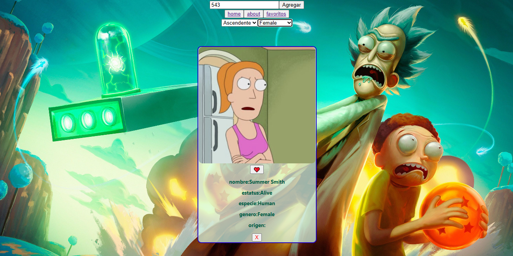

# proyecto-integrador-Rick-and-Morty
### ¿De que va el proyecto?
Este fue mi primer proyecto de desarrollo web, conté con la guía del programa de Henry para implementar cada nuevo conocimiento adquirido. 

### ¿Que hace?
- Buscar y mostrar una serie de targetas que contienen información de la serie animada Rick and Morty.
  

- Añadir y quitar como favoritas aquellas que se desee.
  
 

- Organizar y filtras esos favoritos.

